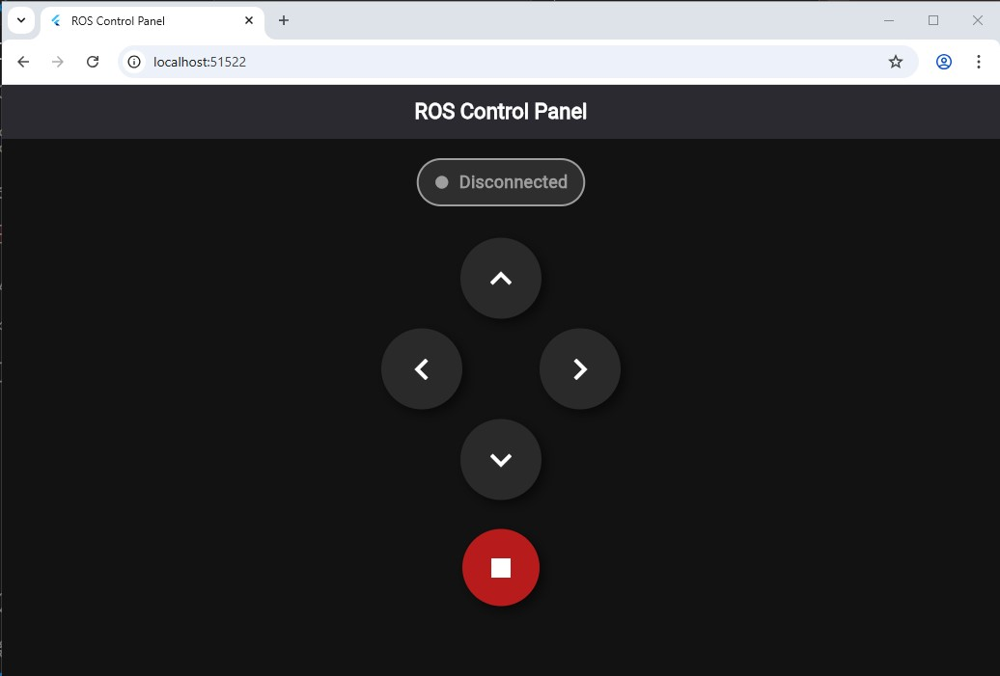

# 🤖 تطبيق تحكم بالروبوت (ROS) باستخدام Flutter

هذا المشروع هو تطبيق لمهمة **الأسبوع السادس (اليوم الرابع)** من التدريب الصيفي لشركة "الأساليب الذكية" (مسار الويب).

الهدف هو بناء لوحة تحكم (Dashboard) باستخدام إطار العمل **Flutter** للتحكم في روبوت يعمل بنظام **ROS (Turtlesim)**. يتم الاتصال بين التطبيق والروبوت بشكل مباشر (Real-time) باستخدام تقنية **WebSocket** و **`rosbridge`**.

---

## 📸 لقطة شاشة من التطبيق (النتيجة)

هذه هي واجهة التطبيق النهائية كما تعمل على متصفح الويب (Google Chrome).

* **ملاحظة:** حالة **"Disconnected"** (أو "Connection Error") هي حالة طبيعية ومتوقعة تماماً في هذا الحل، لأن التطبيق (Frontend) يعمل، ولكن لا يوجد سيرفر (Backend) من ROS ليتصل به.



---

## 🛠️ التقنيات المستخدمة
* **Flutter (Web):** لبناء واجهة المستخدم (Frontend).
* **Dart:** لغة البرمجة الأساسية.
* **`web_socket_channel`:** مكتبة Flutter لإدارة الاتصال بـ WebSocket.
* **ROS 2 (Humble):** نظام تشغيل الروبوت (Backend الافتراضي).
* **`rosbridge_server`:** الجسر الوسيط لنقل الأوامر بين Flutter و ROS.

---

## 📝 ملاحظة هامة: (تطبيق الحل البديل)

كما هو موضح في السيشن، يتطلب التشغيل الكامل للمهمة تشغيل نظام ROS (Ubuntu) على برنامج **VirtualBox (VB)** ليعمل كسيرفر (Backend)، وتشغيل كود Flutter (Frontend) على ويندوز في نفس الوقت.

### سبب عدم تطبيق هذا الحل:
تم الاكتفاء بتسليم "الحل البديل" (برمجة تطبيق Flutter فقط وتوثيق أوامر الـ Backend) نظراً لمحدودية موارد الجهاز المستخدم:

* **نظام التشغيل:** Windows 10
* **الرام (RAM):** 4GB

هذه المواصفات **لا تسمح** بتشغيل برنامج VirtualBox (الذي يستهلك رام لنظام Ubuntu) وبرنامج VS Code (لتطوير Flutter) معاً في نفس الوقت بكفاءة، مما يسبب بطء شديد أو تعليق للجهاز.

---

## 🚀 كيفية تشغيل التطبيق (Frontend)

1.  تأكد من تثبيت Flutter SDK على جهازك.
2.  قم بتحميل ملفات هذا المشروع.
3.  في الطرفية (Terminal)، نفذ أمر تحميل الحزم:
    ```bash
    flutter pub get
    ```
4.  لتشغيل التطبيق على متصفح Google Chrome:
    ```bash
    flutter run -d chrome
    ```

---

## ⚙️ خطوات تشغيل السيرفر (Backend - للتشغيل الكامل مستقبلاً)

هذه هي الأوامر التي **يجب** تشغيلها على جهاز Ubuntu (أو VirtualBox) لتشغيل الروبوت واستقبال الأوامر من تطبيق Flutter (في حال توفر جهاز بمواصفات أعلى).

### 1. (في طرفية Terminal 1): تثبيت وتشغيل جسر ROS
```bash
# أولاً: تثبيت الحزمة (مرة واحدة فقط)
sudo apt update
sudo apt install ros-humble-rosbridge-server

# ثانياً: تشغيل الجسر (بعد تفعيل بيئة ROS)
# source /opt/ros/humble/setup.bash
ros2 launch rosbridge_server rosbridge_websocket_launch.xml
(هذا السيرفر سيعمل على المنفذ 9090)

2. (في طرفية Terminal 2): تشغيل الروبوت (السلحفاة)
Bash

# تشغيل محاكي السلحفاة (بعد تفعيل بيئة ROS)
# source /opt/ros/humble/setup.bash
ros2 run turtlesim turtlesim_node
3. تعديل الكود (عند التشغيل الفعلي)
يجب معرفة الـ IP الخاص بجهاز الـ VirtualBox (باستخدام أمر ip address).

يجب تعديل ملف main.dart في كود Flutter ووضع هذا الـ IP بدلاً من YOUR_ROS_IP_HERE في هذا السطر:

Dart

// استبدل الـ IP بالعنوان الصحيح
final String _rosBridgeUrl = 'ws://192.168.X.X:9090';
